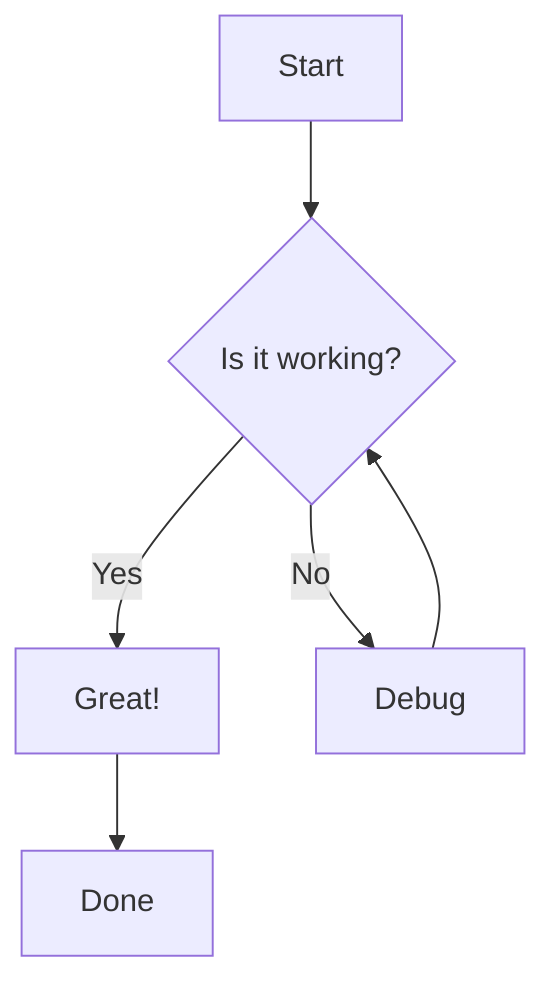
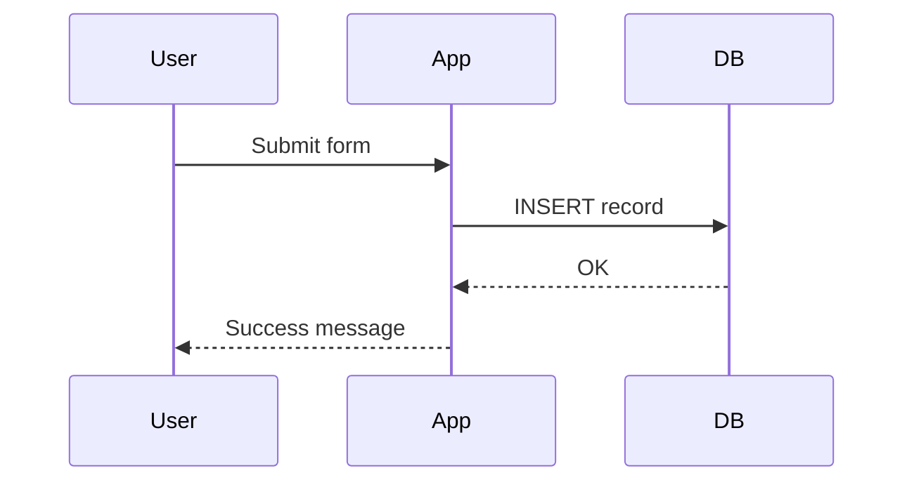
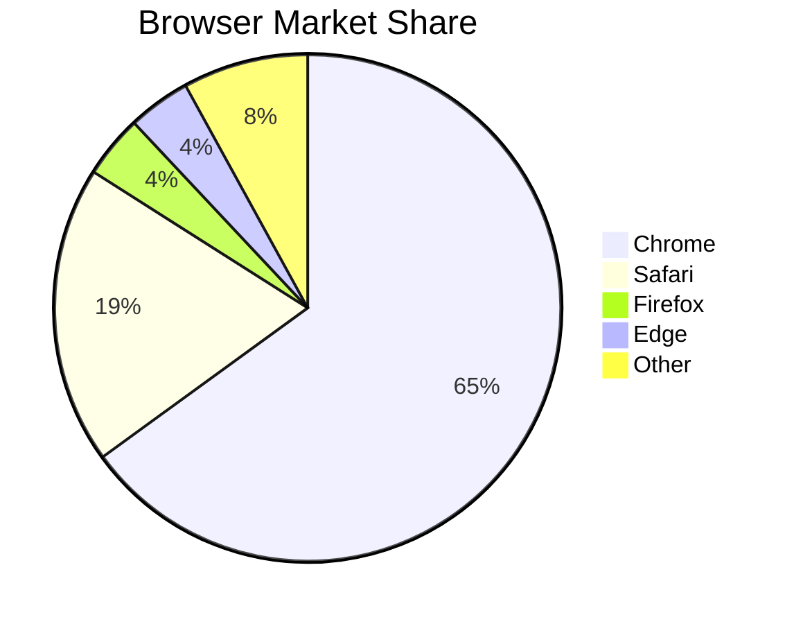

# Markdown Feature Test File

> This file is designed to test standard CommonMark features and widely adopted extensions.
> Use it to verify rendering fidelity across editors, parsers, and preview tools.

---

## Table of Contents

- [Headings](#headings)
- [Paragraphs & Line Breaks](#paragraphs--line-breaks)
- [Emphasis](#emphasis)
- [Blockquotes](#blockquotes)
- [Lists](#lists)
- [Code](#code)
- [Horizontal Rules](#horizontal-rules)
- [Links](#links)
- [Images](#images)
- [Tables](#tables)
- [Task Lists](#task-lists)
- [Footnotes](#footnotes)
- [Definition Lists](#definition-lists)
- [Abbreviations](#abbreviations)
- [Strikethrough & Highlight](#strikethrough--highlight)
- [Subscript & Superscript](#subscript--superscript)
- [Emoji](#emoji)
- [HTML Inline](#html-inline)
- [Math / LaTeX](#math--latex)
- [Mermaid Diagrams](#mermaid-diagrams)
- [Keyboard Keys](#keyboard-keys)
- [Edge Cases](#edge-cases)

---

## Headings

# Heading 1
## Heading 2
### Heading 3
#### Heading 4
##### Heading 5
###### Heading 6

Alternate H1
============

Alternate H2
------------

---

## Paragraphs & Line Breaks

This is a standard paragraph. Lorem ipsum dolor sit amet, consectetur adipiscing elit.
Pellentesque habitant morbi tristique senectus et netus et malesuada fames ac turpis egestas.

This paragraph has a hard line break at the end of this sentence (two trailing spaces).  
This line follows the hard break.

This is a new paragraph separated by a blank line.

---

## Emphasis

*Italic using asterisks*  
_Italic using underscores_

**Bold using asterisks**  
__Bold using underscores__

***Bold and italic using asterisks***  
___Bold and italic using underscores___

~~Strikethrough~~ (GFM / widely supported extension)

==Highlighted text== (extended — may not render in all parsers)

---

## Blockquotes

> This is a simple blockquote.

> Blockquotes can span
> multiple lines.

> ### Blockquote with a heading
>
> And a paragraph inside it.
>
> > Nested blockquote level two.
> >
> > > Nested blockquote level three.

---

## Lists

### Unordered Lists

- Item one
- Item two
  - Nested item A
  - Nested item B
    - Deeply nested item
- Item three

* Asterisk bullet
* Another asterisk bullet

+ Plus bullet
+ Another plus bullet

### Ordered Lists

1. First item
2. Second item
   1. Nested ordered item
   2. Another nested ordered item
3. Third item

### Ordered List with Lazy Numbering

1. First
1. Second (parser should render as 2)
1. Third (parser should render as 3)

### Mixed List

1. Ordered item one
   - Unordered child
   - Another unordered child
2. Ordered item two

### Loose List (paragraphs inside items)

- This item has a paragraph.

  Additional paragraph inside the list item.

- This item also has a paragraph.

  Additional paragraph here too.

---

## Code

### Inline Code

Use `code` inline. Escape backticks with double backticks: `` `backtick` ``.

### Fenced Code Block (no language)

```
Plain fenced code block.
No syntax highlighting expected.
    Indentation preserved.
```

### Fenced Code Block (with language)

```javascript
// JavaScript example
function greet(name) {
  return `Hello, ${name}!`;
}

console.log(greet("World"));
```

```python
# Python example
def greet(name: str) -> str:
    return f"Hello, {name}!"

print(greet("World"))
```

```bash
#!/usr/bin/env bash
echo "Hello from bash"
for i in {1..5}; do
  echo "Line $i"
done
```

```sql
SELECT u.id, u.name, COUNT(o.id) AS order_count
FROM users u
LEFT JOIN orders o ON o.user_id = u.id
GROUP BY u.id, u.name
ORDER BY order_count DESC;
```

```json
{
  "name": "markdown-test",
  "version": "1.0.0",
  "features": ["standard", "extended"],
  "supported": true
}
```

### Indented Code Block (4-space indent)

    This is an indented code block.
    It uses four spaces for indentation.
    No language-specific highlighting.

---

## Horizontal Rules

Three hyphens:

---

Three asterisks:

***

Three underscores:

___

---

## Links

### Inline Links

[Basic link](https://example.com)

[Link with title](https://example.com "Example Domain")

[Relative link](./other-file.md)

### Reference Links

[Reference link][ref1]

[Another reference][ref2]

[Implicit reference][]

[ref1]: https://example.com "Reference One"
[ref2]: https://example.com/two "Reference Two"
[Implicit reference]: https://example.com/implicit

### Autolinks

<https://example.com>

<user@example.com>

Plain URL autolink (GFM): https://example.com

---

## Images

### Inline Image


### Reference Image

![Reference image][img-ref]

[img-ref]: https://via.placeholder.com/200x100 "Reference Image"

### Image with Link

[](https://example.com)

---

## Tables

### Basic Table (GFM)

| Name       | Type    | Required | Description                  |
|------------|---------|----------|------------------------------|
| `id`       | integer | Yes      | Unique identifier            |
| `name`     | string  | Yes      | Display name                 |
| `email`    | string  | No       | Contact email address        |
| `active`   | boolean | No       | Whether the record is active |

### Alignment

| Left Aligned | Center Aligned | Right Aligned |
|:-------------|:--------------:|--------------:|
| Apple        | Banana         | Cherry        |
| Dog          | Elephant       | Fox           |
| 1            | 2              | 3             |

### Minimal Table

|Col A|Col B|
|---|---|
|1|2|

---

## Task Lists

- [x] Completed task
- [x] Another completed task
- [ ] Incomplete task
- [ ] Another incomplete task
  - [x] Nested completed subtask
  - [ ] Nested incomplete subtask

---

## Footnotes

This sentence has a footnote.[^1]

This one has a longer footnote.[^longnote]

[^1]: This is the first footnote.

[^longnote]: This footnote has multiple paragraphs.

    Indent subsequent paragraphs to include them in the footnote.

    You can also include code: `some code here`.

---

## Definition Lists

(Supported in PHP Markdown Extra, Pandoc, and some other parsers.)

Term One
: Definition for term one.

Term Two
: First definition for term two.
: Second definition for term two.

Apple
: The fruit of the apple tree.
: A tech company headquartered in Cupertino, CA.

---

## Abbreviations

(Supported in PHP Markdown Extra and some parsers — abbreviations are auto-expanded on hover.)

The HTML specification is maintained by the W3C.

*[HTML]: HyperText Markup Language
*[W3C]: World Wide Web Consortium

---

## Strikethrough & Highlight

~~This text is struck through.~~

==This text is highlighted.== (Extended — not universally supported)

---

## Subscript & Superscript

H~2~O is water. (Subscript — extended)

E = mc^2^ (Superscript — extended)

HTML fallback: H<sub>2</sub>O and E = mc<sup>2</sup>

---

## Emoji

(Supported on GitHub, GitLab, and many editors.)

:tada: :rocket: :white_check_mark: :warning: :x: :bulb: :book: :gear:

Unicode emoji also work directly: 🎉 🚀 ✅ ⚠️ ❌ 💡 📖 ⚙️

---

## HTML Inline

Markdown allows raw <strong>HTML</strong> inline. This is <em>standard</em> behavior.

<details>
  <summary>Expandable section (click to reveal)</summary>

  This content is hidden inside a `<details>` element. Some parsers render this interactively.

  ```python
  print("Inside a details block!")
  ```
</details>

<br>

<mark>Highlighted via HTML mark tag.</mark>

<kbd>Ctrl</kbd> + <kbd>C</kbd> to copy (HTML keyboard tag).

---

## Math / LaTeX

(Supported in Obsidian, Jupyter, Pandoc, GitHub — rendering varies.)

### Inline Math

The quadratic formula is $x = \frac{-b \pm \sqrt{b^2 - 4ac}}{2a}$.

### Block Math

$$
\int_{-\infty}^{\infty} e^{-x^2} dx = \sqrt{\pi}
$$

$$
\mathbf{F} = m\mathbf{a}
$$

$$
E = mc^2
$$

---

## Mermaid Diagrams

(Supported on GitHub, GitLab, Obsidian, and many modern renderers.)







---

## Keyboard Keys

Using `<kbd>` HTML tags (standard inline HTML):

Press <kbd>Ctrl</kbd> + <kbd>Shift</kbd> + <kbd>I</kbd> to open DevTools.

Press <kbd>⌘</kbd> + <kbd>Space</kbd> on macOS.

---

## Edge Cases

### Empty Table Cell

| A | B | C |
|---|---|---|
| 1 |   | 3 |
|   | 2 |   |

### Escaped Characters

\*Not italic\* \`Not code\` \[Not a link\] \# Not a heading

### Nested Emphasis

This is **bold with _nested italic_ inside it**.

This is _italic with **nested bold** inside it_.

### Long URL in Link

[Long URL](https://example.com/path/to/some/deeply/nested/resource?query=value&other=value2#anchor)

### Unicode and Special Characters

Chinese: 你好世界  
Arabic: مرحبا بالعالم  
Emoji in heading below:

#### 🧪 Emoji in Heading

### Backslash at End of Line (hard break alternative)

Line one\
Line two (backslash line break — supported in some parsers)

### Blank Lines in Blockquote

> First paragraph in blockquote.
>
> Second paragraph in blockquote after blank line.

### Code Span with Special Characters

Inline code with angle brackets: `<div class="test">Hello</div>`

Inline code with backtick: `` Use `code` like this ``

### Very Long Line

This is an intentionally very long line to test how renderers handle wrapping of long text content without any natural break points: aaaaaaaaaaaaaaaaaaaaaaaaaaaaaaaaaaaaaaaaaaaaaaaaaaaaaaaaaaaaaaaaaaaaaaaaaaaaaaaaaaaaaaaaaaaaaaaaaaaaaaaaaaaaaaaaaaaaaaaaaaaaaaaaaaaaaaaaaaa

### Indented Block in List

1. First item with a code block:

   ```python
   print("Indented code block inside a list item")
   ```

2. Second item with a blockquote:

   > This is a blockquote inside a list item.

---

*End of Markdown Feature Test File*

<!-- This is an HTML comment. It should not be visible in rendered output. -->
